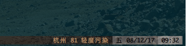

# tmux_pm25
在Tmux的状态栏中显示空气质量指数，主要是pm2.5指数，数据来源[pm25.in](http://www.pm25.in)



## 安装指南

### 依赖

* [Go](http://golang.org) 需要Go来编译文件

### 使用 [Tmux Plugin Manager](https://github.com/tmux-plugins/tpm) (推荐)

在`.tmux.conf`文件中，将下行代码加入你的TPM插件列表中:

set -g @plugin 'DingDean/tmux_pm25'

    
### 手动安装
    
复制此库:
    
$ git clone https://github.com/DingDean/tmux_pm25 ~/clone/path
        
在`.tmux.conf`文件中，将下行代码加入你的TPM插件列表中:
        
run-shell ~/clone/path/tmux_pm25.tmux

### 重载Tmux配置
``` bash
tmux source ~/.tmux.conf
```

## 使用指南

### 配置.tmux_25_config.json
空气指数数据来自于[PM25.in](http://www.pm25.in), 需要一个apiKey来获取数据。为此，请前往网站申请apiKey，之后在你的`$HOME`目录下创建.tmux_25_config.json, 内容如下：
``` Json
{
  "apiKey": "你申请得到的apiKey",
  "city": "城市的拼音，无空格，若不为空字符串，那么此程序将读取此字段代表的城市空气数据而不是你的IP所代表的城市"
}
```

### 配置.tmux.cof

此插件会在tmux的环境中添加一个新的*format name*, `pm25`。

只要在你想要此信息出现的地方加上这个*format name*即可，比如：
``` 
set -gq status-right '#{pm25} %d/%m/%y'
```

## TODO

- [X] 走通远端api
- [X] 建立缓存防止api连接数超过上限
- [X] 根据IP确定要查找的城市空气质量数据
- [X] 用户指定一个城市后，不再根据其IP自动获取数据
- [ ] 美化信息在状态栏上的呈现方式
- [ ] 用个人ApiKey代替测试ApiKey
- [ ] 增加手动刷新数据的快捷键
